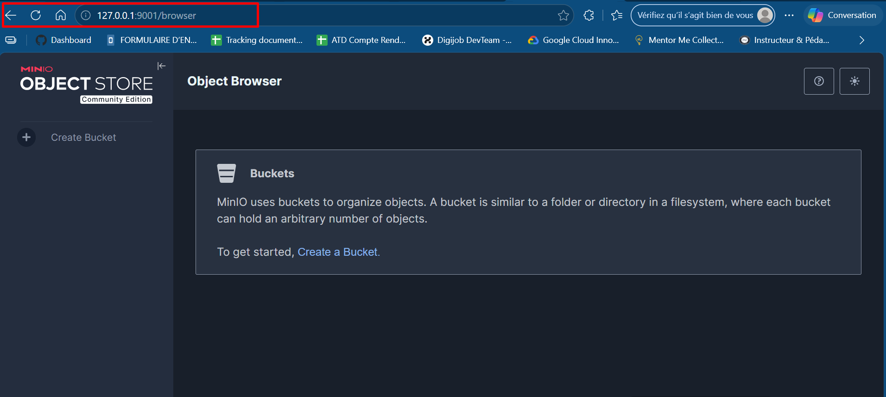
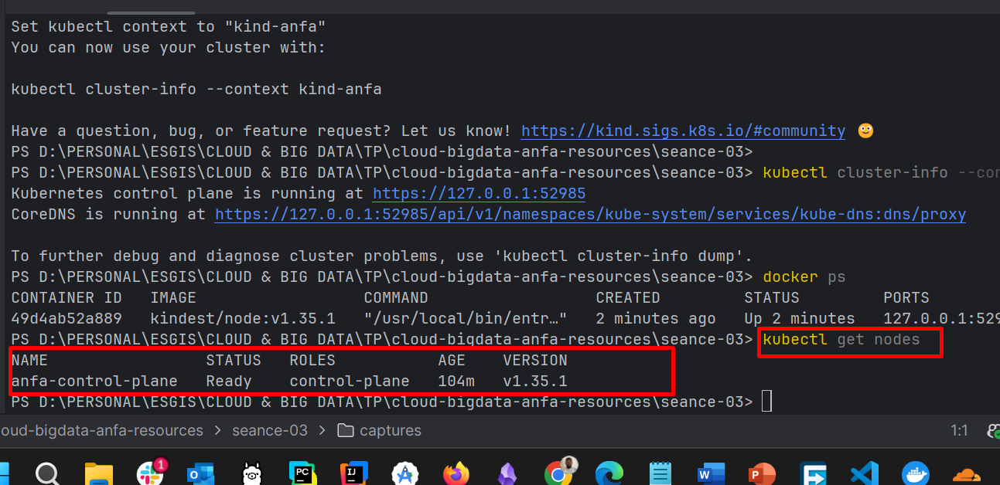
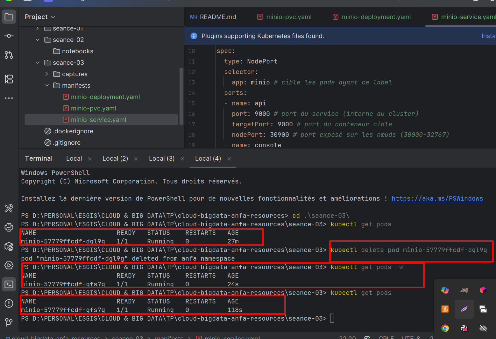
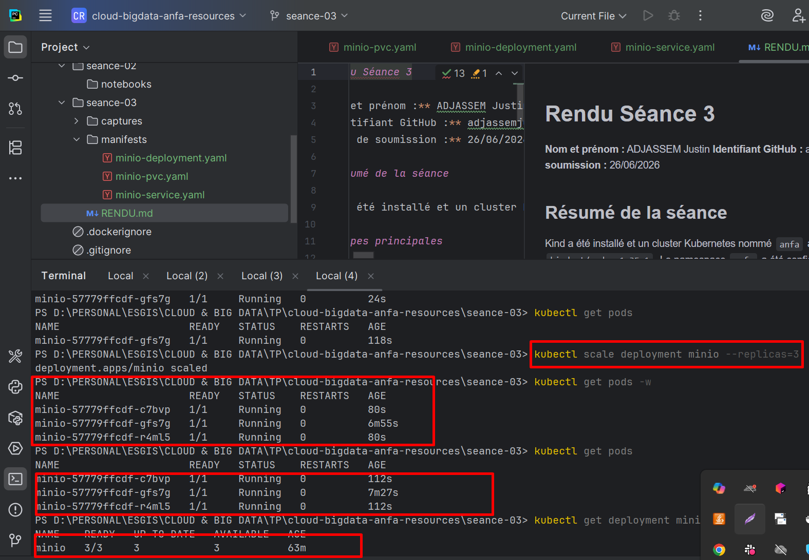

# Rendu Séance 3

**Nom et prénom :** ADJASSEM Justin
**Identifiant GitHub :** adjassemjustin
**Date de soumission :** 26/06/2026


## Étapes principales

1. Installation de Kind et kubectl, création du cluster `anfa`.
2. Création du namespace `anfa` et configuration de kubectl.
3. Déploiement de MinIO via les manifestes YAML (PVC, Deployment).
4. Observation du self-healing après suppression manuelle d'un pod.
5. Scaling du Deployment de 1 à 3 replicas, puis retour à 1.
6. Activation de l'Ingress Controller nginx.

## Captures d'écran

### Console MinIO accessible via port-forward



### Cluster Kubernetes opérationnel



### Self-healing observé



### Scaling à 3 replicas



## Réponses aux exercices d'application

### Exercice 1 : QCM conceptuel

**1.1 – Réponse : B**
Kubernetes est un orchestrateur qui gère des conteneurs sur un cluster de machines ; il s'appuie sur un *container runtime* (containerd, Docker, CRI-O) et ne fournit pas lui-même un moteur de conteneurs.

**1.2 – Réponse : B – etcd**
`etcd` est le magasin clé-valeur distribué qui stocke l'intégralité de l'état du cluster (pods, services, configurations, etc.).

**1.3 – Réponse : C – Scheduler**
Le Scheduler surveille les pods sans nœud assigné et choisit le nœud le plus adapté (ressources disponibles, affinités, etc.) pour les placer.

**1.4 – Réponse : C – À l'API Server**
`kubectl` communique exclusivement avec l'API Server, qui est le point d'entrée unique (et authentifié) du cluster ; c'est lui qui lit l'état dans `etcd` et le renvoie.

**1.5 – Réponse : B**
Le Deployment surveille en permanence le nombre de pods en vie ; si l'un est supprimé, le Controller Manager détecte l'écart avec l'état souhaité et recrée immédiatement un nouveau pod.

**1.6 – Réponse : B – NodePort**
`NodePort` expose le service sur un port fixe de chaque nœud du cluster, permettant un accès externe sans nécessiter de load balancer cloud (contrairement à `LoadBalancer`).

**1.7 – Réponse : B**
La commande modifie le champ `spec.replicas` du Deployment à 5 ; Kubernetes converge ensuite vers cet état souhaité en créant ou supprimant des pods selon le besoin.

**1.8 – Réponse : B**
Un Namespace permet d'isoler logiquement des ressources au sein d'un même cluster (par équipe, environnement dev/prod, ou application), sans isolation réseau ou sécurité forte par défaut.

**1.9 – Réponse : B – Des conteneurs Docker**
Avec Kind (*Kubernetes IN Docker*), chaque nœud du cluster (control-plane et workers) est en réalité un conteneur Docker tournant sur l'hôte local.

---

### Exercice 2 : Lecture et interprétation d'un manifeste

**2.1 – `selector.matchLabels` et `template.metadata.labels`**
`selector.matchLabels` indique au Deployment quels pods il doit gérer : il sélectionne tous les pods dont les labels correspondent. `template.metadata.labels` définit les labels appliqués aux pods créés par ce Deployment. Les deux doivent être identiques (`app: anfa-api`) : c'est ainsi que le Deployment « reconnaît » ses propres pods et peut en surveiller le nombre.

**2.2 – Nombre de pods et comportement en cas de défaillance**
Le champ `replicas: 2` entraîne la création de **2 pods**. Si l'un d'eux meurt (crash, nœud défaillant, suppression manuelle), le Controller Manager détecte l'écart entre l'état réel (1 pod) et l'état souhaité (2 pods) et recrée automatiquement un nouveau pod pour revenir à 2.

**2.3 – Résolution DNS `minio:9000`**
En Kubernetes, chaque Service crée automatiquement une entrée DNS dans le cluster via **CoreDNS**. Si un Service nommé `minio` existe dans le même namespace (`anfa`), Kubernetes résout `minio` en son adresse IP virtuelle (`ClusterIP`). Utiliser un nom plutôt qu'une IP est préférable car les IP peuvent changer ; le nom DNS reste stable tant que le Service existe.

**2.4 – Conséquence de l'absence de Service**
Sans Service, les pods `anfa-api` ne sont accessibles que via leur IP interne individuelle (éphémère et non stable). Aucun autre pod dans le cluster ne peut joindre l'API de façon fiable, et l'API n'est pas du tout accessible depuis l'extérieur du cluster. En pratique, le Deployment est déployé mais inutilisable par les autres composants.

**2.5 – Manifeste de Service ClusterIP**

```yaml
apiVersion: v1
kind: Service
metadata:
  name: anfa-api
  namespace: anfa
spec:
  selector:
    app: anfa-api
  ports:
    - protocol: TCP
      port: 80
      targetPort: 8000
  type: ClusterIP
```

Ce Service sélectionne les pods labellisés `app: anfa-api`, écoute sur le port **80** à l'intérieur du cluster et redirige le trafic vers le port **8000** des conteneurs. Le type `ClusterIP` (valeur par défaut) limite l'accès à l'intérieur du cluster uniquement.

---

### Exercice 3 : Diagnostic

**3.1 – Le pod qui ne démarre pas**

**a. Signification de `ImagePullBackOff`**
Kubernetes a tenté de télécharger l'image Docker spécifiée depuis le registry (Docker Hub par défaut) mais a échoué. Il entre en attente exponentielle (*backoff*) avant de réessayer. La cause peut être une image inexistante, un nom mal orthographié, ou un problème d'authentification.

**b. Cause probable**
Le nom de l'image est `minio/miniooo:latest` — le mot `minio` est mal orthographié (`miniooo` avec trois `o`). Cette image n'existe pas sur Docker Hub, d'où l'échec du pull.

**c. Commande pour obtenir plus de détails**
```bash
kubectl describe pod minio-7d9f8b6c5-x2k9p -n <namespace>
```
La section `Events` en bas du résultat affichera le message d'erreur précis du registry (ex. : `Failed to pull image [...]: not found`).

---

**3.2 – Le PVC qui ne se lie pas**

**a. Signification du statut `Pending`**
`Pending` signifie que Kubernetes n'a pas encore trouvé (ou créé) de PersistentVolume (PV) satisfaisant les contraintes du PVC (capacité, mode d'accès, StorageClass). Le PVC attend qu'un volume disponible lui soit lié.

**b. Cause probable dans un cluster Kind local**
Le PVC demande **500 Gi** de stockage. La StorageClass `standard` de Kind s'appuie sur le provisionnement local (disque de la machine hôte) ; 500 Gi dépasse très probablement la capacité disponible ou les limites du provisioner local. Kind ne peut pas satisfaire une demande aussi grande sur un poste de développement.

**c. Commande pour confirmer le diagnostic**
```bash
kubectl describe pvc data-pvc
```
La section `Events` indiquera pourquoi le provisionnement a échoué (ex. : `no persistent volumes available for this claim`). On peut aussi vérifier les PV existants :
```bash
kubectl get pv
```

---

**3.3 – Le port-forward qui échoue**

**a. Pourquoi cette erreur ?**
`kubectl port-forward` nécessite qu'un pod soit dans l'état `Running` pour établir un tunnel TCP. Si le pod sous-jacent du service `minio` est en `Pending` (non encore schedulé ou en attente de ressources), il n'y a aucun processus auquel se connecter.

**b. Commande pour comprendre le `Pending`**
```bash
kubectl get pods
kubectl describe pod <nom-du-pod-minio>
```
La section `Events` révèle la cause (ressources insuffisantes, PVC non lié, image introuvable, etc.).

**c. Ordre logique à respecter avant un `port-forward`**
1. S'assurer que le pod est dans l'état **`Running`** (`kubectl get pods`)
2. Vérifier que le Service existe et sélectionne bien les pods (`kubectl get svc`, `kubectl describe svc minio`)
3. Seulement ensuite lancer `kubectl port-forward service/minio 9001:9001`

---

### Exercice 4 : De Docker Compose à Kubernetes

**4.1 – Nombre de manifestes Kubernetes nécessaires**

Pour reproduire le service MinIO de Compose, il faut **4 manifestes** distincts :

| Manifeste | Rôle |
|---|---|
| **Deployment** | Définit le pod MinIO (image, commande, variables d'environnement, réplicas) |
| **Service (NodePort ou ClusterIP)** | Expose les ports 9000 (API S3) et 9001 (console) à l'intérieur du cluster ou vers l'extérieur |
| **PersistentVolumeClaim (PVC)** | Demande un volume de stockage persistant pour `/data` |
| **Secret** (optionnel mais recommandé) | Stocke `MINIO_ROOT_USER` et `MINIO_ROOT_PASSWORD` de façon sécurisée plutôt qu'en clair dans le Deployment |

**4.2 – Volume Docker nommé vs PersistentVolumeClaim Kubernetes**

En Docker Compose, un **volume nommé** (`minio-data`) est géré localement par le daemon Docker sur la machine hôte : il est créé à la demande, lié à un répertoire de l'hôte, et sa durée de vie est liée au cycle de vie Docker local.

En Kubernetes, la persistance est **découplée** : le **PersistentVolumeClaim (PVC)** est une *demande* de stockage qui exprime des besoins (capacité, mode d'accès). Un **PersistentVolume (PV)** — créé manuellement ou par un provisioner automatique — représente le stockage physique réel (disque cloud, NFS, etc.). Cette séparation permet à Kubernetes de gérer le stockage indépendamment du cycle de vie des pods, sur n'importe quelle infrastructure.

**4.3 – `localhost:9001` avec Compose vs `port-forward` avec Kind**

Avec Docker Compose, l'option `ports: "9001:9001"` mappe directement le port du conteneur sur un port de la machine hôte grâce au réseau bridge Docker : le système d'exploitation voit le port ouvert sur `localhost`.

Avec Kind, les nœuds Kubernetes sont eux-mêmes des conteneurs Docker : un `NodePort` ouvre un port sur le nœud-conteneur, pas directement sur l'hôte. `kubectl port-forward` crée un tunnel temporaire entre l'hôte et le pod. Pour accéder directement sur un port de l'hôte comme avec Compose, il faudrait configurer Kind avec un **`extraPortMappings`** dans son fichier de configuration (mappant un port hôte vers un NodePort du cluster), ou utiliser un **Ingress controller** avec un port exposé.

**4.4 – Deux apports de Kubernetes vs Docker Compose pour MinIO**

1. **Haute disponibilité et auto-guérison** : si le pod MinIO crashe, Kubernetes le recrée automatiquement sans intervention manuelle, contrairement à Compose où le conteneur reste arrêté jusqu'à un `docker compose up`.

2. **Scalabilité déclarative** : on peut augmenter le nombre de réplicas MinIO avec `kubectl scale` ou un HPA, et Kubernetes répartit la charge. Avec Compose, il faut manuellement définir et gérer les instances supplémentaires.

---

### Exercice 5 : Mini-cas d'architecture

**5.1 – Type d'objet Kubernetes par composant**

| Composant | Type d'objet | Justification |
|---|---|---|
| `pipeline-anfa` | **CronJob** | Le pipeline doit s'exécuter de façon planifiée chaque nuit à 2h ; CronJob permet de définir une expression cron et crée un Job temporaire à chaque déclenchement, qui se termine après exécution. |
| `anfa-api` | **Deployment** | L'API doit être en permanence disponible avec plusieurs réplicas ; le Deployment maintient en continu le nombre souhaité de pods en vie et gère les mises à jour sans interruption. |
| `anfa-dashboard` | **Deployment** | Grafana est une application stateless consultée en journée avec une disponibilité standard ; un Deployment avec 1 ou 2 réplicas suffit pour assurer la continuité de service. |

**5.2 – Paramètres HPA pour `anfa-api`**

```yaml
minReplicas: 2
maxReplicas: 10
metric: CPU utilization, targetAverageUtilization: 60%
```

**Justification :** Le trafic varie de ~5 req/s (creux) à ~50 req/s (pointe matin/soir), soit un rapport 1:10. `minReplicas: 2` garantit la haute disponibilité même au creux (un seul replica serait un SPOF). `maxReplicas: 10` permet d'absorber les pointes. Un seuil de **60 % CPU** offre une marge de sécurité : l'HPA déclenchera le scale-out avant que les pods soient saturés, évitant la dégradation des temps de réponse aux heures de pointe.

**5.3 – Type de Service pour `anfa-api`**

**Réponse : `LoadBalancer`**

L'API sert des applications mobiles de conducteurs, donc des clients **externes** au cluster. Dans un cluster managé chez un fournisseur cloud (GKE, EKS, AKS…), un Service de type `LoadBalancer` provisionne automatiquement un load balancer cloud avec une IP publique stable. C'est la solution la plus adaptée en production pour exposer une API externe, car elle gère la distribution de charge et la tolérance aux pannes nativement.

**5.4 – Gestion des mises à jour sans coupure (`RollingUpdate`)**

Par défaut, Kubernetes utilise la stratégie **RollingUpdate** pour les Deployments. Lors d'une mise à jour de l'image, Kubernetes crée progressivement de nouveaux pods avec la nouvelle version *avant* de supprimer les anciens. Les paramètres `maxUnavailable` (par défaut : 25 %) et `maxSurge` (par défaut : 25 %) contrôlent le rythme : à aucun moment le nombre de pods disponibles ne tombe sous le seuil acceptable. Le Service continue d'envoyer le trafic uniquement vers les pods `Running` et `Ready` (via les *readiness probes*). Le résultat : les utilisateurs ne voient aucune interruption pendant le redéploiement.

**5.5 – Manifeste Deployment pour `anfa-api`**

```yaml
apiVersion: apps/v1
kind: Deployment
metadata:
  name: anfa-api
  namespace: anfa
  labels:
    app: anfa-api
spec:
  replicas: 3
  selector:
    matchLabels:
      app: anfa-api
  strategy:
    type: RollingUpdate
    rollingUpdate:
      maxUnavailable: 1
      maxSurge: 1
  template:
    metadata:
      labels:
        app: anfa-api
    spec:
      containers:
        - name: api
          image: anfa/api:v1
          ports:
            - containerPort: 8000
          env:
            - name: MINIO_ENDPOINT
              value: "http://minio:9000"
          readinessProbe:
            httpGet:
              path: /health
              port: 8000
            initialDelaySeconds: 5
            periodSeconds: 10
```

## Difficultés rencontrées

- La création initiale du cluster Kind a échoué à cause de l'utilisation de **cgroup v1** (déprécié dans Kubernetes v1.35.1). Le kubelet ne démarrait pas et le health check expirait après 4 minutes. Le problème a été résolu en relançant la création du cluster après configuration.
- Les ports 9000 et 9001 n'étaient pas accessibles depuis le navigateur car aucun Service Kubernetes n'était défini. L'accès a été rétabli via `kubectl port-forward` sur le deployment MinIO.
