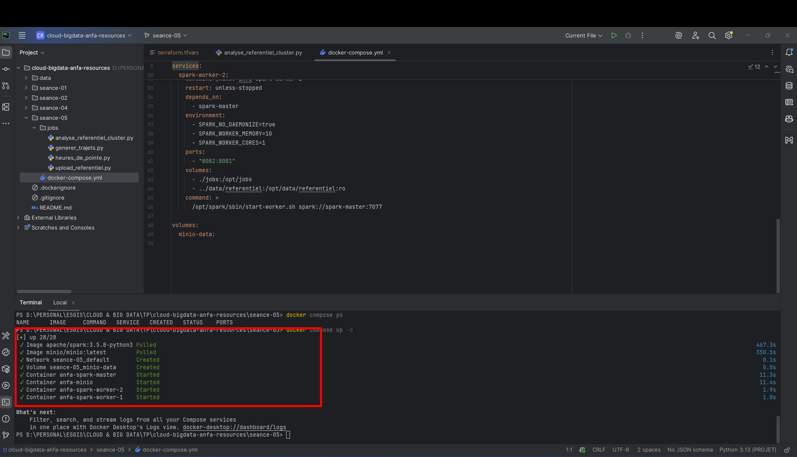
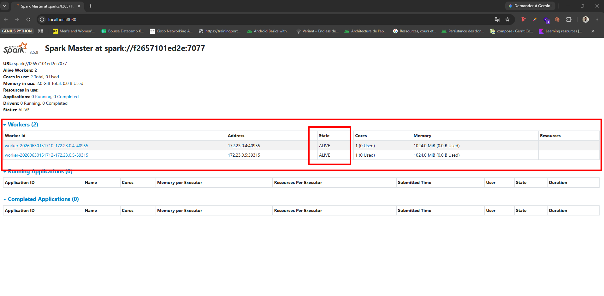
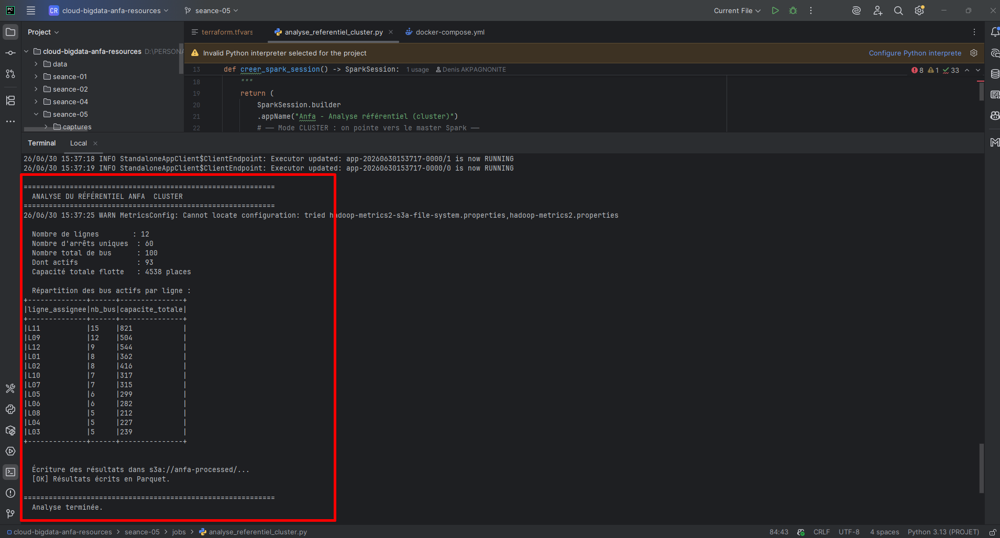
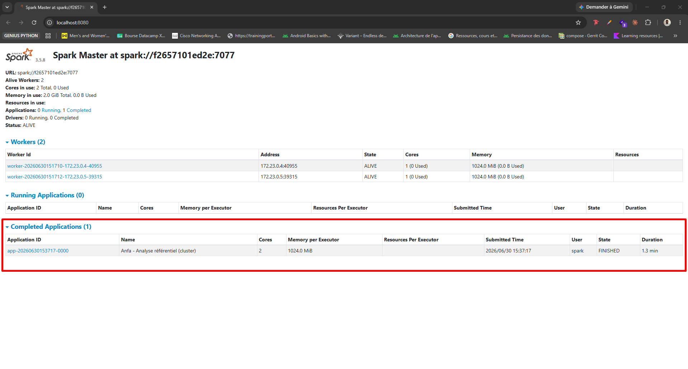
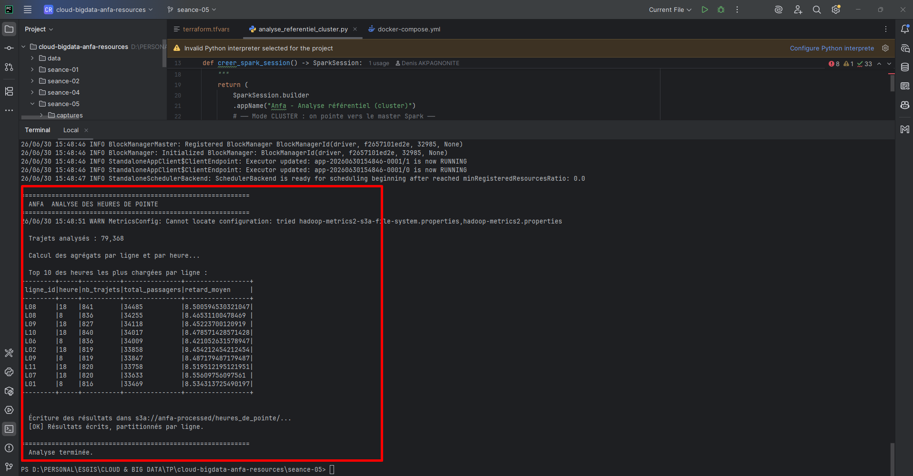
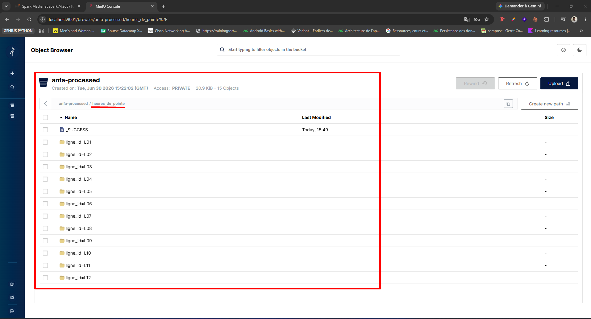

# Rendu Séance 5

**Nom et prénom :** ADJASSEM Yao-fiawomo Justin

## Résumé de la séance

Déploiement d'un cluster Spark standalone (1 master + 2 workers) via Docker Compose. Exécution de jobs PySpark distribués pour analyser le référentiel ANFA lu depuis MinIO, génération d'un historique simulé de trajets avec analyse des heures de pointe, et écriture des résultats en Parquet. Comparaison subjective entre le mode local et le mode cluster.

## Étapes principales

1. Déploiement du cluster Spark standalone (1 master + 2 workers) via Docker Compose.
2. Préparation de MinIO et upload du référentiel.
3. Premier job distribué (`analyse_referentiel_cluster.py`) : statistiques de base.
4. Génération d'un historique simulé de trajets et job d'analyse des heures de pointe.
5. Comparaison subjective entre mode local et mode cluster.

## Captures d'écran

### Déploiement du cluster Spark via Docker Compose

### Dashboard Spark Master avec 2 workers

### Résultats du job analyse référentiel (console)

### Application Spark exécutée avec succès (FINISHED)

### Résultats du Top 10 heures de pointe dans la console

### Bucket anfa-processed avec heures_de_pointe partitionné par ligne

## Réflexion : local vs cluster

- **Temps d'exécution observé :** En mode local, le job s'exécute en quelques secondes sur un petit jeu de données. En mode cluster, le temps total est légèrement plus long à cause de l'overhead de distribution (sérialisation, coordination entre le master et les workers), mais la différence est négligeable sur un petit dataset.
- **Différences perçues :** Le mode local est plus simple à configurer et déboguer (pas besoin de Compose, un seul processus). Le mode cluster apporte une vraie parallélisation avec la répartition des tâches sur les workers, visible dans le dashboard Spark.
- **Quel mode pour quelle situation ?**
  - **Mode local** : développement, prototypage, tests unitaires, petits jeux de données (< quelques Go). Idéal pour itérer rapidement.
  - **Mode cluster** : production, gros volumes de données où le traitement sur une seule machine serait trop lent ou impossible (données ne tenant pas en mémoire). Permet le passage à l'échelle horizontal.

