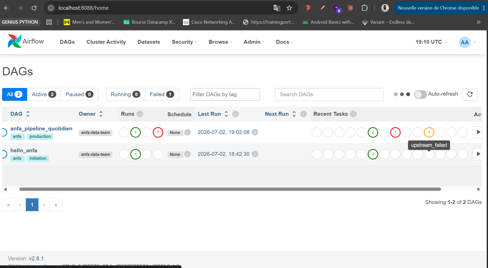
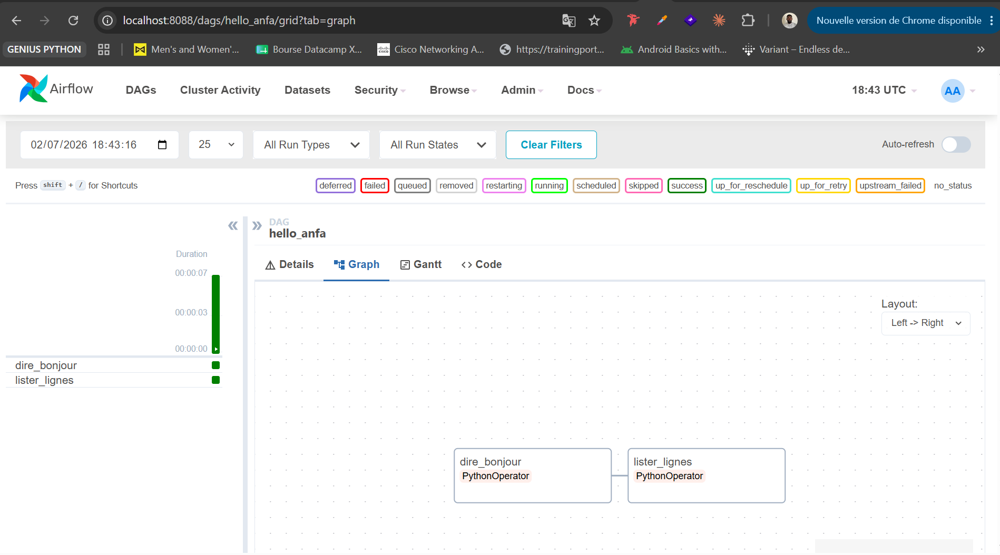
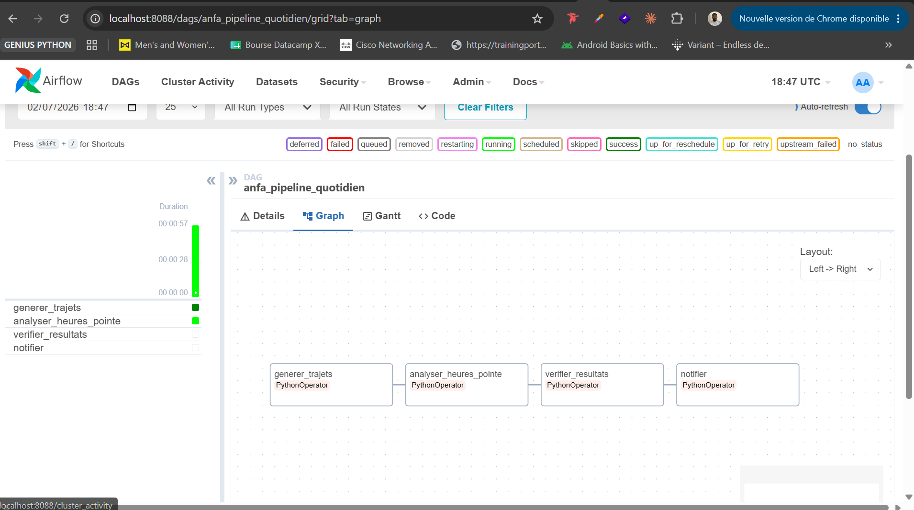
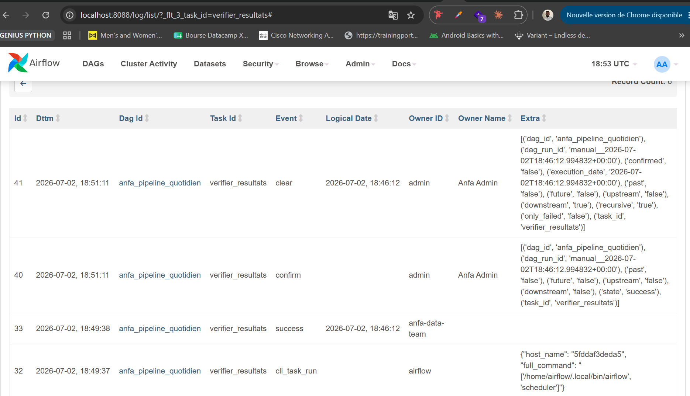
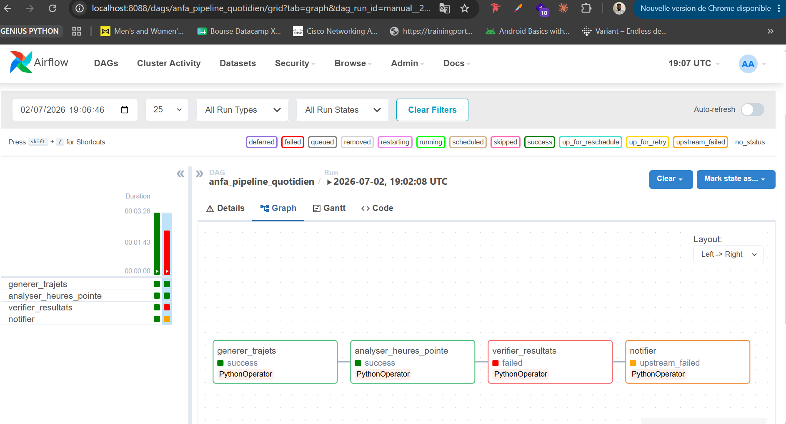

# Rendu : Séance 6

**Nom et prénom :** ADJASSEM Justin
**Identifiant GitHub :** justinadjassem
**Date de soumission :** 02/07/2026

## Résumé de la séance

Airflow déployé via Docker Compose aux côtés de MinIO et Spark. Un premier DAG
simple (`hello_anfa`) a servi à comprendre la mécanique, puis un DAG métier
(`anfa_pipeline_quotidien`) orchestre le pipeline de la séance 5 :
génération → analyse Spark → vérification → notification. Les retries et la
propagation d'échec ont été observés via un bug volontaire.

## Étapes principales

1. Déploiement de la stack (Airflow + PostgreSQL + MinIO + Spark) via Docker Compose.
2. Premier DAG `hello_anfa` à 2 tâches : initiation à la mécanique Airflow.
3. DAG métier `anfa_pipeline_quotidien` à 4 tâches : génération → Spark → vérification → notification.
4. Démonstration des retries et de la gestion d'erreur via un bug volontaire.

## Captures d'écran

### UI Airflow après connexion (vue d'accueil)

### DAG hello_anfa exécuté en succès

### DAG anfa_pipeline_quotidien complet en succès

### Logs de la tâche `verifier_resultats`

### Démonstration du retry : tâche en échec et propagation

## Réflexion personnelle

Airflow apporte une visibilité complète sur l'exécution des pipelines grâce à son interface web, contrairement à cron qui est opaque et ne permet pas de suivre l'état des tâches en temps réel. La gestion des dépendances entre tâches (avec l'opérateur `>>`) garantit l'ordre d'exécution et la propagation des échecs : si une tâche échoue, les tâches en aval ne se lancent pas. Le mécanisme de retries automatiques avec délai configurable permet de gérer les erreurs transitoires sans intervention manuelle. Sur un vrai projet, Airflow est pertinent dès qu'on a un pipeline de données avec plusieurs étapes dépendantes, par exemple un ETL quotidien qui extrait, transforme puis charge des données, où la traçabilité et la reprise sur erreur sont essentielles.

## Difficultés rencontrées

- Conflit de noms de conteneurs Docker (`anfa-minio`, `anfa-spark-master`) avec ceux de la séance 05 : résolu en supprimant les anciens conteneurs avec `docker rm -f`.
- PostgreSQL 18 incompatible avec le volume monté sur `/var/lib/postgresql/data` : résolu en changeant le point de montage vers `/var/lib/postgresql` et en recréant le volume.
