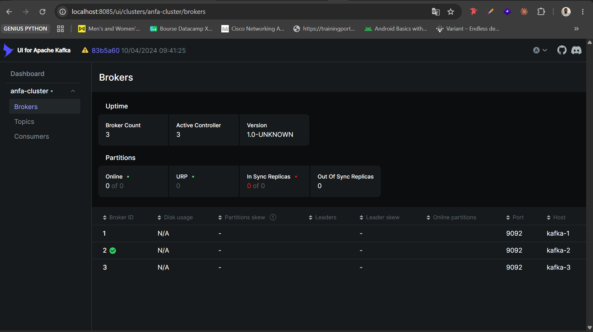
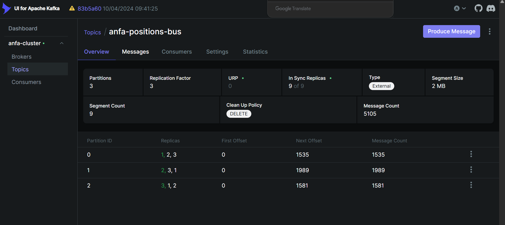
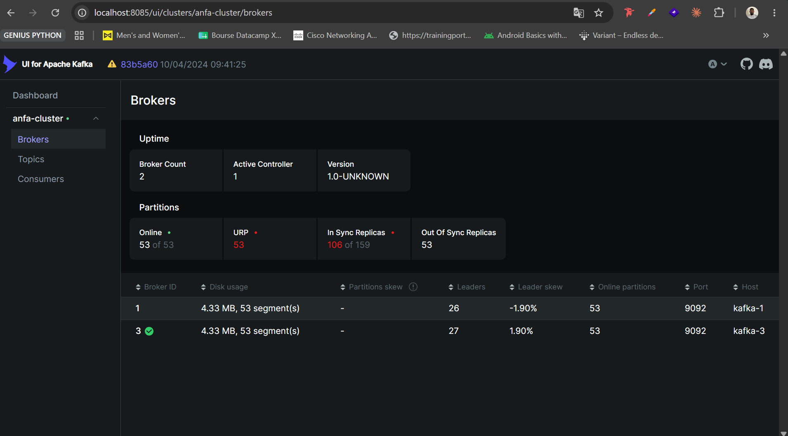
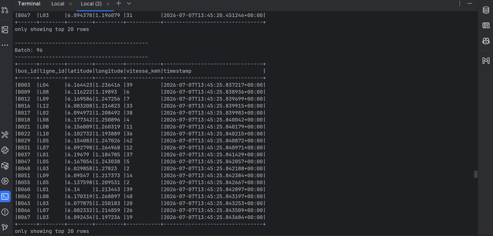
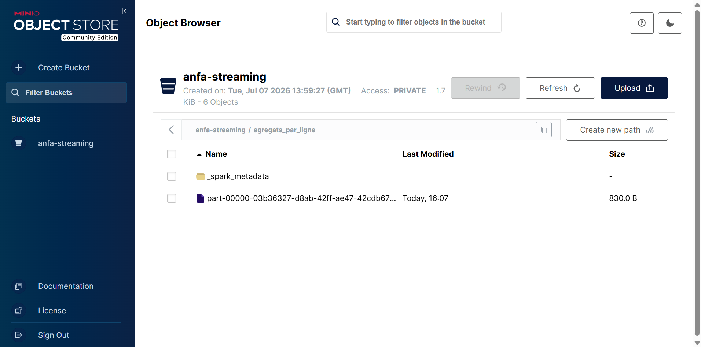

# Rendu — Séance 7

**Nom et prénom :** ADJASSEM Justin
**Identifiant GitHub :** adjassemjustin
**Date de soumission :** 07/07/2026

## Résumé de la séance

Durant cette séance, nous avons déployé un cluster Apache Kafka à 3 brokers en mode KRaft avec Docker Compose, puis créé le topic `anfa-positions-bus` (3 partitions, facteur de réplication 3). Un simulateur Python a généré en continu les positions GPS de 100 bus sur 12 lignes. Nous avons vérifié la tolérance aux pannes en arrêtant un broker : le cluster a continué à fonctionner avec 2 brokers sur 3, les partitions se redistribuant automatiquement. Enfin, Spark Structured Streaming a consommé le flux Kafka, agrégé les données par fenêtre de 30 secondes et par ligne, puis écrit les résultats au format Parquet dans MinIO.

## Étapes principales

1. Déploiement du cluster Kafka (3 brokers, mode KRaft) + Kafka UI.
2. Création du topic `anfa-positions-bus` (3 partitions, réplication 3).
3. Premier producer/consumer Python pour comprendre la mécanique.
4. Simulation de 100 bus envoyant leur position en continu.
5. Démonstration de tolérance aux pannes (arrêt d'un broker).
6. Spark Structured Streaming : lecture console, puis agrégation en fenêtre vers MinIO.

## Captures d'écran

### 3 brokers actifs dans Kafka UI

### Débit de messages en augmentation

### Cluster avec 2 brokers sur 3 (après arrêt volontaire)

### Micro-batchs affichés en console par Spark

### Résultats agrégés dans MinIO

## Réflexion personnelle

Le pipeline Kafka + Spark Streaming est adapté aux cas nécessitant un traitement en temps réel ou quasi-réel, par exemple le suivi en direct d'une flotte de bus, la détection d'anomalies ou les alertes instantanées. En revanche, le pipeline batch Airflow + Spark (séances 5-6) convient mieux aux traitements planifiés sur de gros volumes historiques (rapports quotidiens, ETL nocturnes) où la latence de quelques heures est acceptable.

La réplication à 3 brokers m'a concrètement montré la résilience de Kafka : après l'arrêt volontaire de kafka-2, le cluster a continué à produire et consommer sans perte de messages. Les URP (Under-Replicated Partitions) sont montées à 53 et les Out Of Sync Replicas à 53, mais toutes les partitions sont restées en ligne (53 sur 53). Cela illustre l'intérêt du facteur de réplication 3 : on peut perdre un broker sans interruption de service.

## Difficultés rencontrées

Le job Spark Structured Streaming d'agrégation ne produisait pas de fichiers Parquet dans MinIO. Le dossier `agregats_par_ligne/` ne contenait que `_spark_metadata`. Après investigation, deux causes ont été identifiées :
1. Le simulateur de bus n'était plus actif au moment du lancement du job d'agrégation, et celui-ci utilisait `startingOffsets = "latest"` (ne lit que les nouveaux messages).
2. L'ancienne application Spark (lecture console) monopolisait le seul core du worker, empêchant le job d'agrégation d'obtenir des ressources (`Initial job has not accepted any resources`).
Après avoir tué l'ancienne app, relancé le simulateur et nettoyé les checkpoints, les fichiers Parquet sont apparus correctement.
