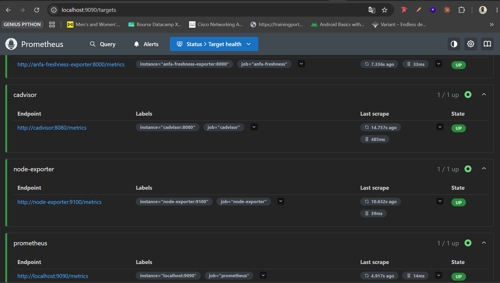
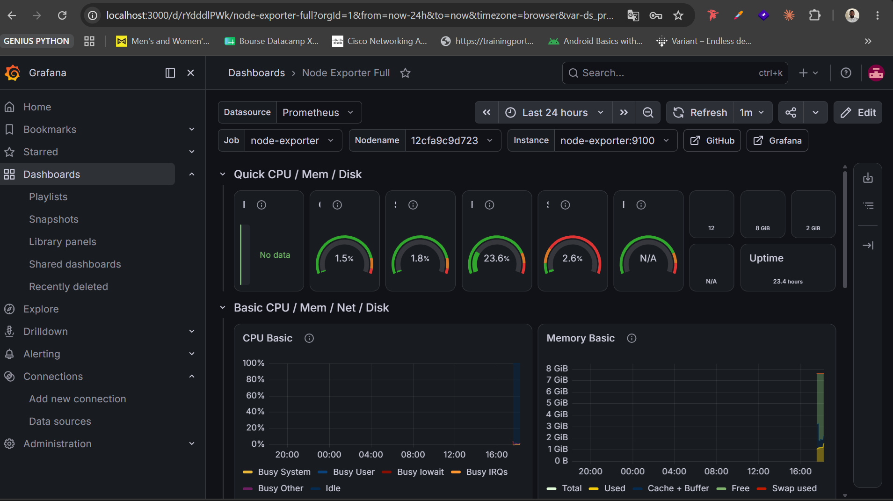
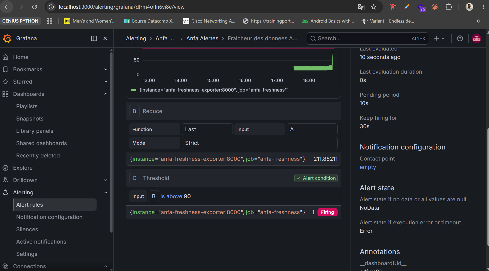

# Rendu — Séance 9

**Nom et prénom :** ADJASSEM Justin
**Identifiant GitHub :** adjassemjustin
**Date de soumission :** 09/07/2026

## Résumé de la séance

Déploiement d'une stack de monitoring complète (Prometheus, Grafana, Node Exporter, cAdvisor) ainsi qu'un exportateur métier custom mesurant la fraîcheur des données Anfa. Construction d'un dashboard Grafana avec import du template "Node Exporter Full" et création d'un panneau custom. Configuration d'une alerte sur la métrique de fraîcheur et validation par simulation d'une panne silencieuse déclenchant l'état Firing.

## Étapes principales

1. Déploiement de Prometheus, Node Exporter, cAdvisor, Grafana et d'un exportateur
   métier custom (fraîcheur des données Anfa).
2. Exploration des cibles Prometheus et premières requêtes PromQL.
3. Import du dashboard "Node Exporter Full" et construction d'un panneau custom.
4. Configuration d'une alerte Grafana sur la fraîcheur des données.
5. Simulation d'une panne silencieuse et observation du déclenchement de l'alerte.

## Captures d'écran

### Les 4 cibles Prometheus à l'état UP

### Dashboard "Node Exporter Full" importé

### Alerte à l'état Firing après panne simulée

## Réflexion personnelle

Cette séance répond directement à la situation-problème d'Awa dans le CM : un pipeline peut tourner sans erreur visible (conteneurs actifs, CPU/RAM normaux) tout en produisant des données obsolètes. Les métriques classiques d'infrastructure (CPU, RAM, statut des conteneurs) ne détectent pas ce type de panne silencieuse. La métrique de fraîcheur (`anfa_freshness_seconds`) comble ce manque en mesurant l'âge réel des dernières données ingérées, permettant de déclencher une alerte avant que les utilisateurs ne s'en rendent compte. C'est la différence entre surveiller la santé technique d'un système et surveiller la qualité effective du service rendu.

## Difficultés rencontrées

Aucune difficulté majeure. La stack Docker Compose s'est déployée sans problème et les cibles Prometheus ont été détectées automatiquement.
